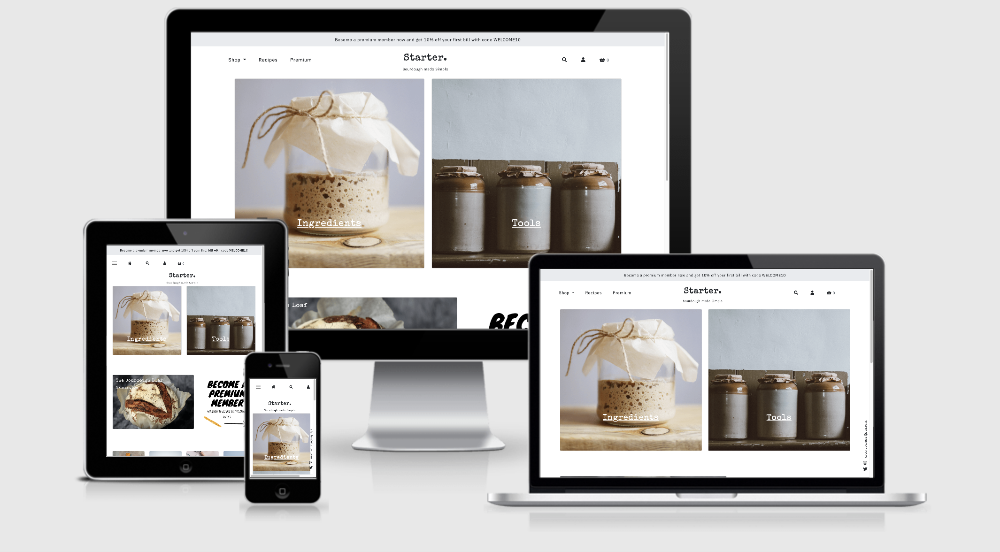

# Starter

## Milestone Project 4: Full Stack Frameworks with Django - Code Institute
As one of the more difficult trends of the UK lockdown, [Starter](#) aims to simplify the processes involved in baking with sourdough by providing recipes and useful tools of the trade (available for purchase). A number of free recipes are provided, with paid membership required for access to premium recipes.

## Table of Contents

1. 

UX

   - [User Stories](#user-stories)

     - [First Time User Goals](#first-time-user-goals)
     - [Returning User Goals](#returning-user-goals)
     - [Member Goals](#returning-user-goals)
     - [Premium Member Goals](#premium-member-goals)
     - [Admin](#admin-goals)

   - [Design](#design)
     - [Colour Scheme](#colour-scheme)
     - [Typography](#typography)
     - [Imagery](#imagery)
     - [Icons](#icons)
     - [Layout](#layout)
     - [Styling](#styling)
     - [Wireframes](#wireframes)
         

2. 

Features

   - [Existing Features](#existing-features)

     - [Elements on every page](#elements-on-every-page)
     - [Shop](#shop)
     - [Product Details](#product-details)
     - [Basket](#basket)
     - [Product Checkout](#checkout)
     - [Recipes](#recipes)
     - [Recipe](#recipe)
     - [Premium](#add-plant-page)
     - [Subscription Checkout](#subscription-checkout)
     - [Stripe Subscription Checkout](#stripe-subscription-checkout)
     - [User Account](#user-acccount)
     - [Subscription Settings][#subscription-settings]
     - [Allauth Pages][#allauth-pages]

   - [Features Left to Implement](#features-left-to-implement)
     

3. 

Information Architecture
   

   - [Database Choice](#database-choice)

   - [Collections Data Structure](#collections-data-structure)

   

4. 

Technologies Used
   

   - [Languages](#languages)

   - [Frameworks, Libraries & Programs Used](#frameworks,-libraries-&-programs-used)

   

5. 

Testing
   

   - [testing.md](./testing.md)

   

6. 

Deployment
   

   - [Requirements](#requirements)

   - [Making a Local Clone on Gitpod](#making-a-local-clone-on-gitpod)

   - [Heroku Deployment](#heroku-deployment)

   

7. 

Credits
   

   - [Content](#content)

   - [Media](#media)

   - [Code](#code)

   - [Acknowledgements](#acknowledgements)
   

# UX

## User Stories

### First Time User Goals 
#### As a first time user, I want to: 

1. Easily understand the purpose of the website and the services it offers
2. Be able to navigate intuitively through the site

### Returning User Goals
#### As a returning, I want to:

1. Browse all products and recipes
2. Browse via product category
3. Search for product and/or recipe by name or description
4. Easily see what I've searched for and the search results
5. As a Returning User, I want to easily select the colour and quantity of a product
6. View items in my basket to be purchased
7. Be able to adjust the quantity of individual items in my basket 
8. See an order confirmation after checkout
9. Receive an email confirmation after checkout
10. Easily find how to become a member
11. Learn about becoming a premium member

### Member Goals
#### As a member, I want to:

1. Easily login and logout
2. Receive an email confirmation upon registering
3. Recover my password in case I forget it
4. Save/update my shipping information
5. View my order history

### Premium Member Goals
#### As a premium member, I want to:

1. View premium content 
2. See when new premium content is added
3. View which subscription service is enabled
4. Easily cancel a subscription service
5. View my next subscription payment date

### Admin Goals
#### As admin, I want to:

1. Add a product
2. Edit/update a product
3. Delete a product
4. Add a recipe 
5. Edit/update a recipe 
6. Delete a recipe
7. Ensure all subscriptions payments are up to date

## Design

The overall design is clean and simple, reflecting the the purpose of the website. 

### Colour Scheme

- Colour was used minimullay in order to not detract from the content.
- Bootstrap colours were used on icons in toasts to signal different responses:
    - Success = BS Success
    - Info = BS Info
    - Error = BS Danger
    - Warning = BS Warning 

### Typography

- 'Special Elite' was used for headings and titles as well as the main logo. This type-writer like font was chosen to give the impression of a story or a book. 
- 'Knewave' was used to promote premium content to make it look like a poster.
- 'IBM Plex Sans' was used for all other text. It was chosen for it's readability. 
- A range of font sizes and weights were used to denote importance.
- All fonts had Sans Serif as the back-up font. 

### Imagery
**Bootstrap's 'img-fluid' class was used on the majority of images to ensure responsivity.**

#### Product Images
All product imagery is sized at 640 x 640px based on [this](https://store.magenest.com/blog/ecommerce-product-image/#:~:text=or%20just%20larger.-,Medium%20size%3A%20Product%20pages,or%20800%20x%20800%20image.) Magenest article.

#### Recipe Images
All recipes images are sized at 1200 x 800px based on [this](https://wordpress.org/support/topic/ideal-recipe-picture-size/#:~:text=So%20to%20answer%20the%20size,access%20to%20the%20larger%20images.) Wordpress forum. 

#### Illustrations

Illustrations were taken from the above Adobe stock image and used throughout the website, complimenting the title/logo font by creating the impression of a story or book. 

#### Membership promo

The membership promo was created in the image of a poster to grab the user's attention and direct them to the premium membership page. 

#### No Image

The 'No Image' image is used in the event that an image is not uploaded for a product or recipe. 

### Icons
Icons are used throughout the site to provide the user with visual cues and create a more interesting aesthetic.

- Chevron icons are used throughout, to indicate directional links.
- Social media icons are clearly positioned to the left of the footer and are constantly available to the user. Dead links are used as the social media pages to exist at present.
- A crown icon is used when to denote premium membership. 

