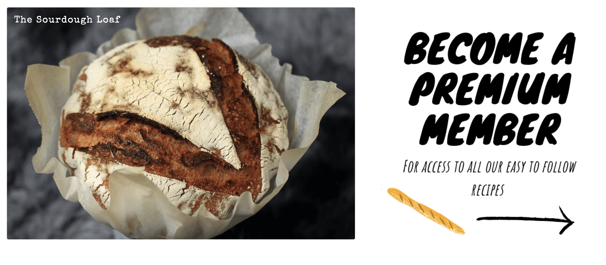
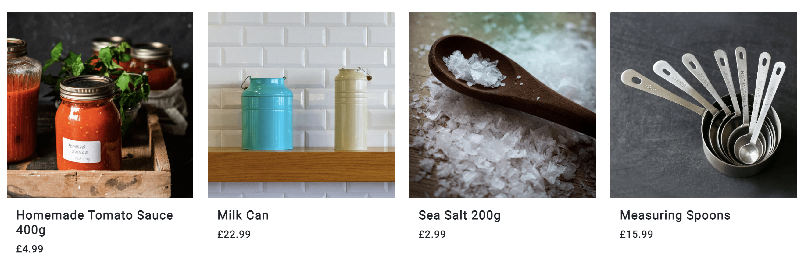
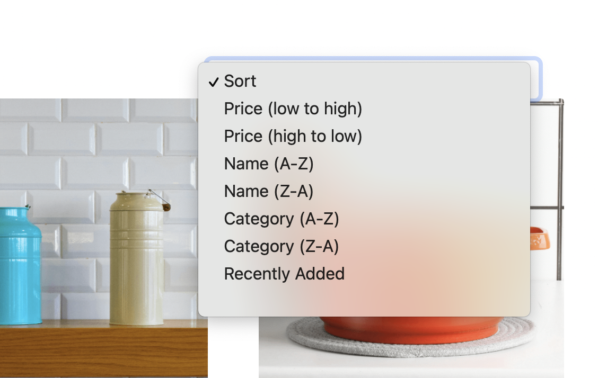
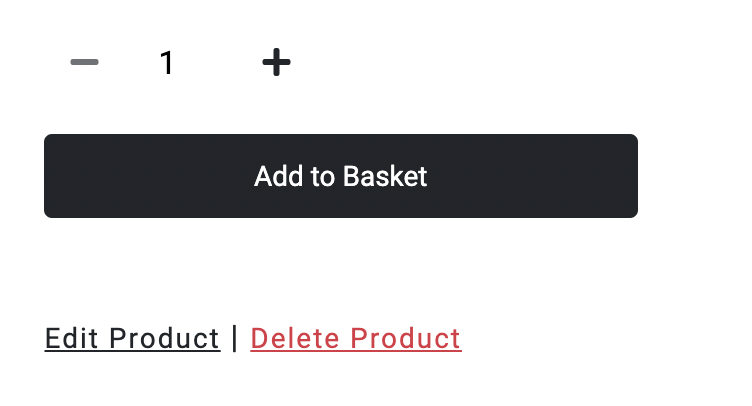
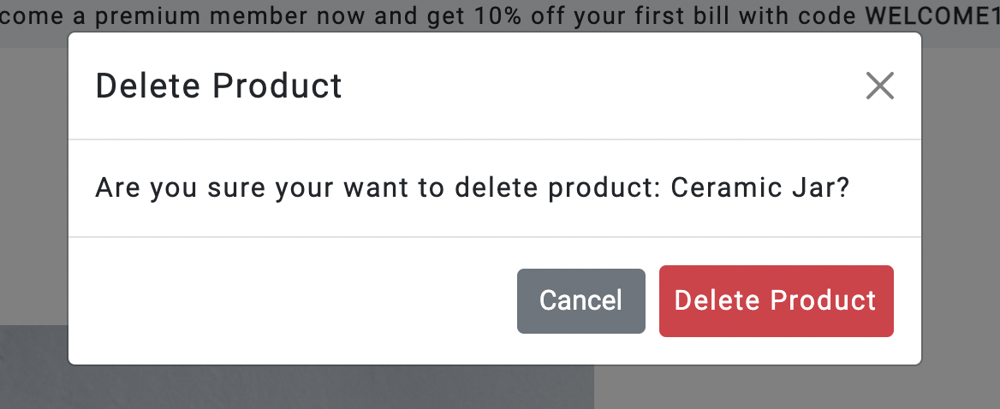
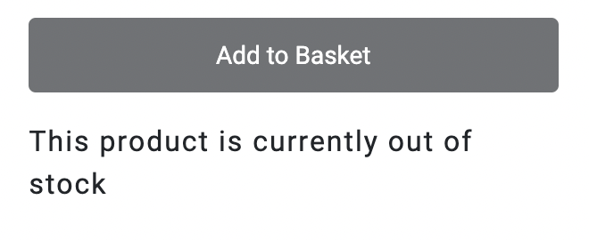
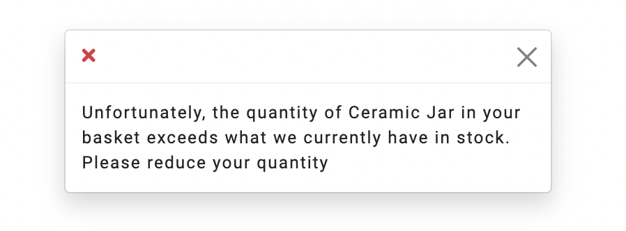
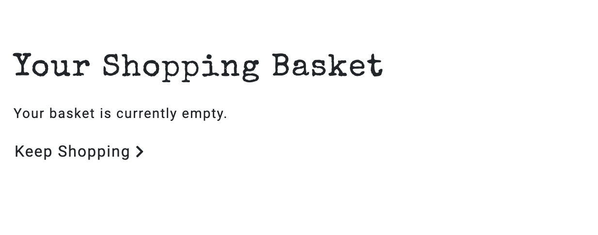
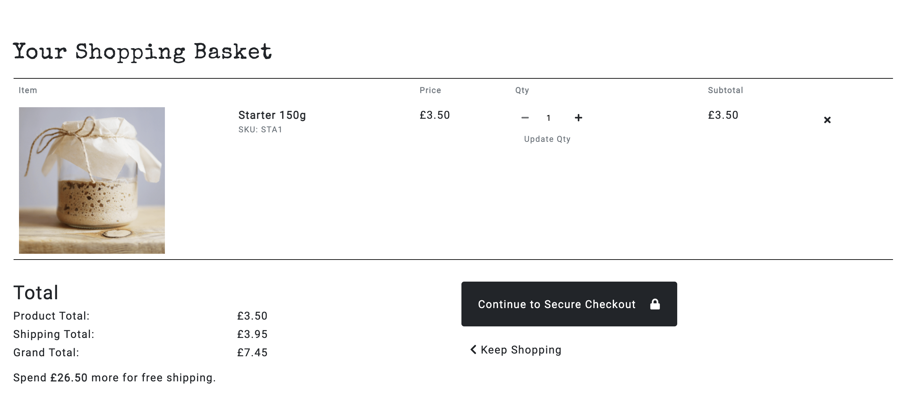

# Starter

## Milestone Project 4: Full Stack Frameworks with Django - Code Institute

[Deployed Version](https://starter-sourdough.herokuapp.com/)

As one of the more difficult trends of the UK lockdown, Starter is an e-commerce website that aims to simplify the processes involved in baking with sourdough. The website offers recipes and useful tools of the trade (available for purchase). A number of free recipes are provided, with paid membership required for access to premium recipes.

**Please use the following card number for test purposes:**
4242 4242 4242 4242

## Table of Contents

1. 

UX

   - [User Stories](#user-stories)

     - [First Time User Goals](#first-time-user-goals)
     - [Returning User Goals](#returning-user-goals)
     - [Member Goals](#returning-user-goals)
     - [Premium Member Goals](#premium-member-goals)
     - [Admin](#admin-goals)

   - [Design](#design)
     - [Colour Scheme](#colour-scheme)
     - [Typography](#typography)
     - [Imagery](#imagery)
     - [Icons](#icons)
     - [Layout](#layout)
     - [Styling](#styling)
     - [Wireframes](#wireframes)
         

2. 

Features

   - [Existing Features](#existing-features)

     - [Elements on every page](#elements-on-every-page)
     - [Shop](#shop)
     - [Product Details](#product-details)
     - [Basket](#basket)
     - [Product Checkout](#checkout)
     - [Recipes](#recipes)
     - [Recipe](#recipe)
     - [Premium](#add-plant-page)
     - [Subscription Checkout](#subscription-checkout)
     - [Stripe Subscription Checkout](#stripe-subscription-checkout)
     - [User Account](#user-acccount)
     - [Subscription Settings][#subscription-settings]
     - [Allauth Pages][#allauth-pages]

   - [Features Left to Implement](#features-left-to-implement)
     

3. 

Information Architecture
   

   - [Database Choice](#database-choice)

   - [Collections Data Structure](#collections-data-structure)

   

4. 

Technologies Used
   

   - [Languages](#languages)

   - [Frameworks, Libraries & Programs Used](#frameworks,-libraries-&-programs-used)

   

5. 

Testing
   

   - [testing.md](./testing.md)

   

6. 

Deployment
   

   - [Requirements](#requirements)

   - [Making a Local Clone on Gitpod](#making-a-local-clone-on-gitpod)

   - [Heroku Deployment](#heroku-deployment)

   

7. 

Credits
   

   - [Content](#content)

   - [Media](#media)

   - [Code](#code)

   - [Acknowledgements](#acknowledgements)
   

# UX

## User Stories

### First Time User Goals 
#### As a first time user, I want to: 

1. Easily understand the purpose of the website and the services it offers
2. Be able to navigate intuitively through the site

### Returning User Goals
#### As a returning, I want to:

1. Browse all products and recipes
2. Browse via product category
3. Search for product and/or recipe by name or description
4. Easily see what I've searched for and the search results
5. As a Returning User, I want to easily select the colour and quantity of a product
6. View items in my basket to be purchased
7. Be able to adjust the quantity of individual items in my basket 
8. See an order confirmation after checkout
9. Receive an email confirmation after checkout
10. Easily find how to become a member
11. Learn about becoming a premium member

### Member Goals
#### As a member, I want to:

1. Easily login and logout
2. Receive an email confirmation upon registering
3. Recover my password in case I forget it
4. Save/update my shipping information
5. View my order history

### Premium Member Goals
#### As a premium member, I want to:

1. View premium content 
2. See when new premium content is added
3. View which subscription service is enabled
4. Easily cancel a subscription service
5. View my next subscription payment date

### Admin Goals
#### As admin, I want to:

1. Add a product
2. Edit/update a product
3. Delete a product
4. Add a recipe 
5. Edit/update a recipe 
6. Delete a recipe
7. Ensure all subscriptions payments are up to date

## Design

The overall design is clean and simple, reflecting the the purpose of the website. 

### Colour Scheme

- Colour was used minimullay in order to not detract from the content.
- Bootstrap colours were used on icons in toasts to signal different responses:
    - Success = BS Success
    - Info = BS Info
    - Error = BS Danger
    - Warning = BS Warning 

### Typography

- 'Special Elite' was used for headings and titles as well as the main logo. This type-writer like font was chosen to give the impression of a story or a book. 
- 'Knewave' was used to promote premium content to make it look like a poster.
- 'IBM Plex Sans' was used for all other text. It was chosen for it's readability. 
- A range of font sizes and weights were used to denote importance.
- All fonts had Sans Serif as the back-up font. 

### Imagery
**Bootstrap's 'img-fluid' class was used on the majority of images to ensure responsivity.**

#### Product Images
All product imagery is sized at 640 x 640px based on [this](https://store.magenest.com/blog/ecommerce-product-image/#:~:text=or%20just%20larger.-,Medium%20size%3A%20Product%20pages,or%20800%20x%20800%20image.) Magenest article.

#### Recipe Images
All recipes images are sized at 1200 x 800px based on [this](https://wordpress.org/support/topic/ideal-recipe-picture-size/#:~:text=So%20to%20answer%20the%20size,access%20to%20the%20larger%20images.) Wordpress forum. 

#### Illustrations

Illustrations were taken from the above Adobe stock image and used throughout the website, complimenting the title/logo font by creating the impression of a story or book. 

#### Membership promo

The membership promo was created in the image of a poster to grab the user's attention and direct them to the premium membership page. 

#### No Image

The 'No Image' image is used in the event that an image is not uploaded for a product or recipe. 

### Icons
Icons are used throughout the site to provide the user with visual cues and create a more interesting aesthetic.

- Chevron icons are used throughout, to indicate directional links.
- Social media icons are clearly positioned to the left of the footer and are constantly available to the user. Dead links are used as the social media pages to exist at present.
- A crown icon is used when to denote premium membership. 

### Layout
- [Bootstrap's Grid System](https://getbootstrap.com/docs/5.0/layout/grid/) was used throughout to created the layout and make it responsive.

### Styling
- [Bootstrap](https://getbootstrap.com/) was used in conjunction with custom spacing and colours to provide much of the styling for the site. This includes all **buttons**, **cards** and **nav bars**.
- [Django Crispy Forms](https://django-crispy-forms.readthedocs.io/) was used to automatically style form elements.
- [Stripe Elements](https://stripe.com/docs/stripe-js) was used to style the product checkout.
- [Stripe Checkout](https://stripe.com/docs/payments/checkout) was used for the subscription/premium membership checkout. 

### Wireframes

- [Homepage](./static/images/readme-images/wireframes/Homepage.png)

- [Shop](./static/images/readme-images/wireframes/Shop.png)

- [Product Details](./static/images/readme-images/wireframes/Product-Details.png)

- [Shopping Basket](./static/images/readme-images/wireframes/Shopping-Basket.png)

- [Product Checkout](./static/images/readme-images/wireframes/Checkout.png)

- [Recipes](./static/images/readme-images/wireframes/Recipes.png)

- [Recipe Details](./static/images/readme-images/wireframes/Recipe-Details.png)

- [Premium](./static/images/readme-images/wireframes/Premium.png)

- [Premium Basket](./static/images/readme-images/wireframes/Premium-Basket.png)

- [Account](./static/images/readme-images/wireframes/Account.png)

# Features

## Existing Features

### Elements on every page

#### Navbar
- The main navigation to the left of the bar shows the main website pages avaible to everyone.
- The icon links to the right represent other key features of the site. 
- Active classes are added to active page to show the user what page they are currently on.
- Account options differ depending on user: 
    - Not logged in:
        - Sign In 
        - Sign Up
    - Logged in:
        - Account 
        - Sign Out
    - Admin/Superuser:
        - Product Management 
        - Recipe Management
        - Account
        - Sign In 
        - Sign Out
    - Django/Python checks whether a user is logged in or not with `if request.user.is_authenticated` and whether the user is a Superuser with `if request.user.is_superuser ` to display the correct navigation to the user. 

- Mobile Nav 
    - The main navigation and account collapse in to a burger nav icon.
    - The subheading of the logo is dropped.

- Dropdowns
    - Dropdowns were used to reserve space. 
    - The background is solid white to prevent any background interference.

#### Promo Banner

- The promo banner is placed at the top of the screen to immediately alert the user of promotions. 
- The banner is removed on mobile views to reserve space.

#### Toasts

- Bootstrap toasts are used to provide feedback to the user for certain actions, e.g. adding/removing a product, signing in/out. 
- The toast also provides a running summary of the user's shopping basket and link to proceed. 

#### Footer 

- To reflect the nature of the website, the footer only contains the bare necessities; social links and contact email.

### Homepage

- The homepage immediately directs the user to shop for either ingredients or tools. Clicking either will take the user to their specified shopping category.

- Both the Product and Recipe modal contain a boolean field called 'featured' 

- The home app uses python to filter recipes/products by 'featured' which are passed in to a Django template and sliced to display the correct amount for the layout: 

    - `for recipe in featured_recipes|slice:":1"`
    - `for product in featured_products|slice:":4"`

- This option allows superusers to customise their homepage by ticking the featured checkbox when creating or editing a product/recipe. 

- To the left, a promotional poster is displayed to encourage the user to become a member. Clicking navigates user to the premium purchase options. 

#### Promo Poster
- The Promo Poster was created to alert the user to the website's premium membership. 

### Shop / Products Page

#### Products
- Bootstrap cards were used to display product information
- If user's arrived on the shop page via the 'all' navigation all products will be visable.
- If user's arrived on the shop page via the 'tools' or 'ingredients' the products will be filtered by their respective category with the category name displayed e.g:

#### Product Count

- Logic to display product count of selected filter: `{{ products|length }}`

#### Sort Options

- User's are able to sort products by a number of options to make shopping easier. 

### Product Details Page

#### Buttons

- The quantity buttons use javascript to overlay the default plus/minus buttons to fit with the style of the website.

- The Add to Basket uses python/django to add the specified quantity of the specified product to the shopping basket. If successful, a success toast is triggered with a summary of the shopping basket and the items are stored in the session. 

- The edit/delete buttons are only visable if the user is a Superuser: `if request.user.is_superuser `. 

- Clicking delete triggers a defensive modal:

#### Inventory / Stock
Python logic is used to prevent the user from adding products to their basket that are out of stock or exceed the amount of inventory currently in stock. 

- If a product has 0 Inventory, the 'Add to Basket' button is disable and a message is displayed. 

- If a product exce the amount of inventory currently in stock a toast is displayed and the product is not added to the basket. 

### Shopping Basket

#### Empty Shopping Basket 

#### Shopping Basket with Contents

#### Product Controls
- The user is able to update the quantity of the item or remove the item before proceeding to checkout. 

#### Total 
- Keeps a running total of all products and shipping. 
- If the total amounts to less than the free shipping threshold a message is displayed to inform the user of how much more they have to spend to qualify for free shipping.

#### Direction Buttons
- The 'Continue to Secure Checkout' is the most prominent button on the page to direct the user to the checkout.
- The keep shopping button takes the user back to products.

