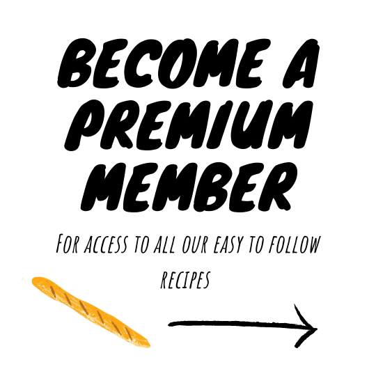
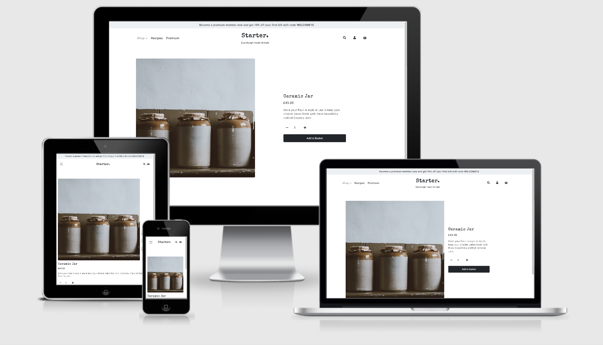
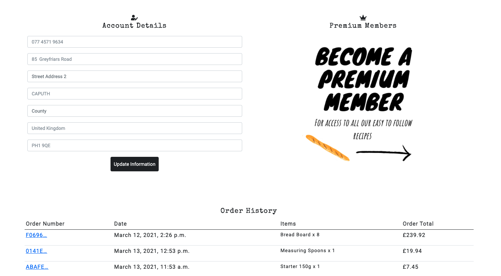
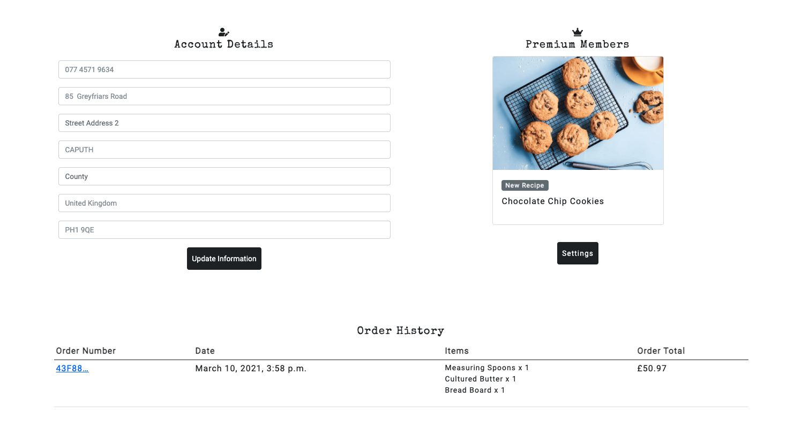
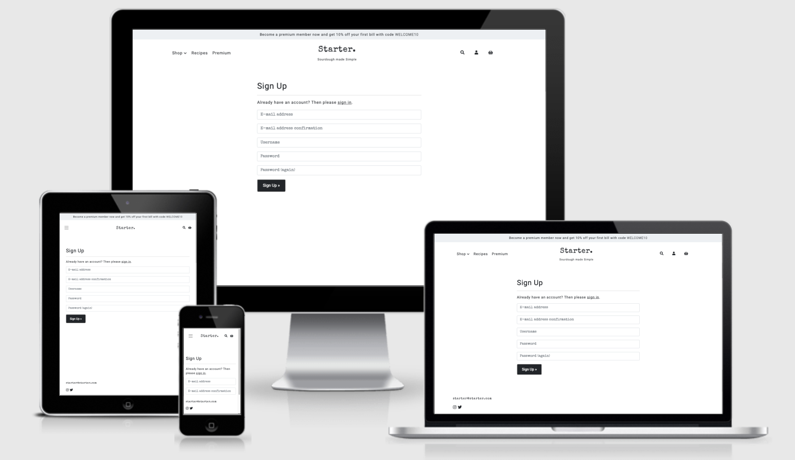

# Starter


## Milestone Project 4: Full Stack Frameworks with Django - Code Institute

[Deployed Version](https://starter-sourdough.herokuapp.com/)

As one of the more difficult trends of the UK lockdown, Starter is an e-commerce website that aims to simplify the processes involved in baking with sourdough. The website offers recipes and useful tools of the trade (available for purchase). A number of free recipes are provided, with paid membership required for access to premium recipes.

**Please use the following card number for test purposes:**
4242 4242 4242 4242

## Table of Contents

1. <details><summary>UX</summary>

   - [User Stories](#user-stories)

     - [First Time User Goals](#first-time-user-goals)
     - [Returning User Goals](#returning-user-goals)
     - [Member Goals](#returning-user-goals)
     - [Premium Member Goals](#premium-member-goals)
     - [Admin](#admin-goals)

   - [Design](#design)
     - [Colour Scheme](#colour-scheme)
     - [Typography](#typography)
     - [Imagery](#imagery)
     - [Icons](#icons)
     - [Layout](#layout)
     - [Styling](#styling)
     - [Wireframes](#wireframes)
         </details>

2. <details><summary>Features</summary>

   - [Existing Features](#existing-features)

     - [Elements on every page](#elements-on-every-page)
     - [Shop](#shop)
     - [Product Details](#product-details)
     - [Basket](#basket)
     - [Product Checkout](#product-checkout)
     - [Recipes](#recipes)
     - [Recipe](#recipe)
     - [Premium](#premium)
     - [Premium Checkout](#premium-checkout)
     - [Stripe Premium Checkout](#stripe-premium-checkout)
     - [User Account](#user-acccount)
     - [Premium Settings](#premium-settings)
     - [Allauth Pages](#allauth-pages)
     - [Confirmation Emails](#allauth-pages)

   - [Features Left to Implement](#features-left-to-implement)
     </details>

3. <details><summary>Information Architecture
   </summary>

   - [Database Choice](#database-choice)

   - [Collections Data Structure](#collections-data-structure)

   </details>

4. <details><summary>Technologies Used
   </summary>

   - [Languages](#languages)

   - [Frameworks, Libraries & Programs Used](#frameworks,-libraries-&-programs-used)

   </details>

5. <details><summary>Testing
   </summary>

   - [testing.md](./testing.md)

   </details>

6. <details><summary>Deployment
   </summary>

   - [Requirements](#requirements)

   - [Making a Local Clone on Gitpod](#making-a-local-clone-on-gitpod)

   - [Heroku Deployment](#heroku-deployment)

   </details>

7. <details><summary>Credits
   </summary>

   - [Content](#content)

   - [Media](#media)

   - [Code](#code)

   - [Acknowledgements](#acknowledgements)
   </details>


# UX

## User Stories

### First Time User Goals 
#### As a first time user, I want to: 

1. Easily understand the purpose of the website and the services it offers
2. Be able to navigate intuitively through the site

### Returning User Goals
#### As a returning, I want to:

1. Browse all products and recipes
2. Browse via product category
3. Search for product and/or recipe by name or description
4. Easily see what I've searched for and the search results
5. As a Returning User, I want to easily select the quantity of a product to be added to the basket
6. View items in my basket to be purchased
7. Be able to adjust the quantity of individual items in my basket 
8. See an order confirmation after checkout
9. Receive an email confirmation after checkout
10. Easily find how to become a member
11. Learn about becoming a premium member


### Member Goals
#### As a member, I want to:

1. Easily login and logout
2. Receive an email confirmation upon registering
3. Recover my password in case I forget it
4. Save/update my shipping information
5. View my order history


### Premium Member Goals
#### As a premium member, I want to:

1. View premium content 
2. See when new premium content is added
3. View which subscription service is enabled
4. Easily cancel a subscription service
5. View my next subscription payment date

### Admin Goals
#### As admin, I want to:

1. Add a product
2. Edit/update a product
3. Delete a product
4. Add a recipe 
5. Edit/update a recipe 
6. Delete a recipe
7. Ensure all subscriptions payments are up to date
8. Customise the homepage to include featured products/recipes

## Design

The overall design is clean and simple, reflecting the the purpose of the website. 

### Colour Scheme


- Colour was used minimullay in order to not detract from the content.
- Bootstrap colours were used on icons in toasts to signal different responses:
    - Success = BS Success
    - Info = BS Info
    - Error = BS Danger
    - Warning = BS Warning 

### Typography

- 'Special Elite' was used for headings and titles as well as the main logo. This type-writer like font was chosen to give the impression of a story or a book. 
- 'Knewave' was used to promote premium content to make it look like a poster.
- 'IBM Plex Sans' was used for all other text. It was chosen for it's readability. 
- A range of font sizes and weights were used to denote importance.
- All fonts had Sans Serif as the back-up font. 


### Imagery
**Bootstrap's 'img-fluid' class was used on the majority of images to ensure responsivity.**

#### Product Images
All product imagery is sized at 640 x 640px based on [this](https://store.magenest.com/blog/ecommerce-product-image/#:~:text=or%20just%20larger.-,Medium%20size%3A%20Product%20pages,or%20800%20x%20800%20image.) Magenest article.

#### Recipe Images
All recipes images are sized at 1200 x 800px based on [this](https://wordpress.org/support/topic/ideal-recipe-picture-size/#:~:text=So%20to%20answer%20the%20size,access%20to%20the%20larger%20images.) Wordpress forum. 

#### Illustrations

Illustrations were taken from the above Adobe stock image and used throughout the website, complimenting the title/logo font by creating the impression of a story or book. 


#### Membership promo

The membership promo was created in the image of a poster to grab the user's attention and direct them to the premium membership page. 

#### No Image


The 'No Image' image is used in the event that an image is not uploaded for a product or recipe. 

### Icons
Icons are used throughout the site to provide the user with visual cues and create a more interesting aesthetic.

- Chevron icons are used throughout, to indicate directional links.
- Social media icons are clearly positioned to the left of the footer and are constantly available to the user. Dead links are used as the social media pages to exist at present.
- A crown icon is used when to denote premium membership. 

### Layout
- [Bootstrap's Grid System](https://getbootstrap.com/docs/5.0/layout/grid/) was used throughout to created the layout and make it responsive.

### Styling
- [Bootstrap](https://getbootstrap.com/) was used in conjunction with custom spacing and colours to provide much of the styling for the site. This includes all **buttons**, **cards** and **nav bars**.
- [Django Crispy Forms](https://django-crispy-forms.readthedocs.io/) was used to automatically style form elements.
- [Stripe Elements](https://stripe.com/docs/stripe-js) was used to style the product checkout.
- [Stripe Checkout](https://stripe.com/docs/payments/checkout) was used for the subscription/premium membership checkout. 

### Wireframes

- [Homepage](./static/images/readme-images/wireframes/Homepage.png)

- [Shop](./static/images/readme-images/wireframes/Shop.png)

- [Product Details](./static/images/readme-images/wireframes/Product-Details.png)

- [Shopping Basket](./static/images/readme-images/wireframes/Shopping-Basket.png)

- [Product Checkout](./static/images/readme-images/wireframes/Checkout.png)

- [Recipes](./static/images/readme-images/wireframes/Recipes.png)

- [Recipe Details](./static/images/readme-images/wireframes/Recipe-Details.png)

- [Premium](./static/images/readme-images/wireframes/Premium.png)

- [Premium Basket](./static/images/readme-images/wireframes/Premium-Basket.png)

- [Account](./static/images/readme-images/wireframes/Account.png)


# Features

## Existing Features

### Elements on every page


#### Navbar
- Account options differ depending on user: 
    - Not logged in:
        - Sign In 
        - Sign Up
    - Logged in:
        - Account 
        - Sign Out
    - Admin/Superuser:
        - Product Management 
        - Recipe Management
        - Update Premium Memberships
        - Account
        - Sign In 
        - Sign Out
    - Django/Python checks whether a user is logged in or not with `if request.user.is_authenticated` and whether the user is a Superuser with `if request.user.is_superuser ` to display the correct navigation to the user. 

- Mobile Nav 

    - The main navigation and account collapse in to a burger nav icon.
    - The subheading of the logo is dropped.

- Dropdowns


    - Dropdowns were used to reserve space. 
    - The background is solid white to prevent any background interference.

- Search 

#### Promo Banner

- The promo banner is placed at the top of the screen to immediately alert the user of promotions. 
- The banner is removed on mobile views to reserve space.

#### Toasts

- Bootstrap toasts are used to provide feedback to the user for certain actions, e.g. adding/removing a product, signing in/out. 
- The toast also provides a running summary of the user's shopping basket and link to proceed. 

#### Footer 

- To reflect the nature of the website, the footer only contains the bare necessities; social links and contact email.

### Homepage


- The homepage immediately directs the user to shop for either ingredients or tools. Clicking either will take the user to their specified shopping category.

- Both the Product and Recipe modal contain a boolean field called 'featured' 

- The home app uses python to filter recipes/products by 'featured' which are passed in to a Django template and sliced to display the correct amount for the layout: 

    - `for recipe in featured_recipes|slice:":1"`
    - `for product in featured_products|slice:":4"`

- To the left, a promotional poster is displayed to encourage the user to become a member. Clicking navigates user to the premium purchase options. 

#### Promo Poster
- The Promo Poster was created to alert the user to the website's premium membership. 


### Shop / Products


#### Products
- Bootstrap cards were used to display product information

#### Product Count

- Logic to display product count of selected filter: `{{ products|length }}`

#### Sort Options


- User's are able to sort products by a number of options to make shopping easier. 

### Product Details


#### Buttons


- The quantity buttons use javascript to overlay the default plus/minus buttons to fit with the style of the website.

- The Add to Basket uses python/django to add the specified quantity of the specified product to the shopping basket. If successful, a success toast is triggered with a summary of the shopping basket and the items are stored in the session. 

- Edit/delete buttons are visable if the user is a Superuser: `if request.user.is_superuser `. 

- Clicking delete triggers a defensive modal:


#### Inventory / Stock
Python logic is used to prevent the user from adding products to their basket that are out of stock or exceed the amount of inventory currently in stock. 

- If a product has 0 Inventory, the 'Add to Basket' button is disable and a message is displayed. 


- If a product exce the amount of inventory currently in stock a toast is displayed and the product is not added to the basket. 


### Shopping Basket

#### Empty Shopping Basket 


#### Shopping Basket with Contents

- The information is laid out in clear way to allow user's to review for proceeding.

#### Product Controls
- The user is able to update the quantity of the item or remove the item before proceeding to checkout. 

#### Total 
- Keeps a running total of all products and shipping. 
- If the total amounts to less than the free shipping threshold a message is displayed to inform the user of how much more they have to spend to qualify for free shipping.

#### Directional Buttons
- The 'Continue to Secure Checkout' is the most prominent button on the page to direct the user to the checkout.
- The keep shopping button takes the user back to products.

### Product Checkout


#### Product Details
- The user is displayed a summary of what they are about to purchase for final review.

#### The Form
- The form combines stripe elements with crispy forms to provide the logic and styling. 
- Contact Information: 
    - If the user is annonymous, they are prompted to sign / in or register to save their contact information. This will be related to the user's profile. 
    - If the user is logged in ( `if user.is_authenticated` ) a checkbox to save shipping information is visable:
    
    - If ticked the shipping information is then save on the user's profile. This time saving feature makes user's more likely to proceed with a purchase in the future. 
    - If a required field is left empty the user is alerted and prevented from proceeding:
    

- Payment Information:
    - Stripe is used to handle payments
    - The user is informed of invalid payment information with the alerts from Stripe:
    

- Completing payment  
    - The complete payment button sends the entered information and triggers a loading screen: 
    
    - The loading screen informs that their request is being handled and therefor prevents refereshing or any other interuption that may effect the payment process.


### Product Checkout Success

- Provides user's with a summary of their order and informs them that an email has been sent to their account as assurance. 

### Recipes


#### Subtitle 
- Python/Django checks if profile has membership attached with `if profile.membership`
- If the user is not logged in or does not have a membership they are encouraged to become a premium in order to access premium content: 

- If the user has a membership: 


#### Recipe Cards
- The recipe cards feature a large photo, recipe title and a free or premium tag.
- Having both free and premium content shows the user the quality of the recipes making them more likely to want to access the premium content.
- Python/Django checks if the recipe is premium with `if recipe.premium` and displays the correct tag accordingly:


### Recipe Details


- Python/Django handels whether a user has premium membership to access premium recipes: `  if request.user.userprofile.membership`

#### Bootstrap Accordian
- A Bootstrap accordian is used to show/hide subsections of the recipe. 
- Ingredients are rendered using a bootstrap table for clarity. 

#### Buttons
- Edit/delete buttons are visable if the user is a Superuser: `if request.user.is_superuser `. 

### Premium


#### Payment Options
- Bootstrap images cards are used to display the two payemnt options.
- The cars are of one whole image split in to two for visual impact and continuity. 
- Overlayed text is white and has a text-shadow to ensure readability.
- Clicking on either takes the user to checkout with specified option.

#### Promotional Offer
- The promotional offer displayed in the banner is repeated below the payment options as a reminder to users before proceeding. 

### Premium Basket/Checkout

- The user must have profile, to which the membership will be attached, to access this page. 
- If the user is not logged in / does not have a profile they will be redirected to the Sign In page: 

- If the user already has a membership they will be redirected to their account:

- The premium basket mirrors the shopping basket for continuity.
- The information is laid out in clear way to allow user's to review for proceeding.
- The user is informed that promo codes can be entered at the next stage. 
- A back button is provided in case the user wants to change payment option. 

### Stripe Premium Checkout

- [Stripe Checkout](https://stripe.com/docs/billing/subscriptions/checkout) is used to render information and handle payment of subscriptions. 
- If the user goes clicks the back arrow they are re-directed to the transaction cancelled page to reassure them that they will not be charged: 

- Stripe creates the subscription `stripe.checkout.Session.create`.

### Premium Checkout Success

- If the transaction is successful, the membership will be attached to their account and the user will be able to see the changes immediately. 
- Successful payment is confirmed by the checkout success page. 

### Account 
#### Account Details
- If the user has previously purchased something and ticked the [Save Shipping Details](#the-form) checkbox at checkout this form will be populated with the saved information.
- Users can update this information to populate the contact information on the [Product Checkout](#product-checkout) page.

#### Premium Membership
- If a user does not have a membership:


- If a user has membership:

- Python/Django inserts the most recently added recipe.
- The settings button takes the user to their membership settings. 

#### Order History 
- Displays user's order history in a Bootstrap table.
- Clicking the order number takes the user to the specified order summary, that mirrors that of the [Product Checkout Success](#product-checkout-success) page, with an altered message:


### Premium Settings

- This page retrieves information from the user's specific Stripe Subscription `stripe.Subscription.retrieve(request.user.userprofile.stripe_subscription_id)` and renders it to the display.
- The Cancel Membership triggers a defensive modal:

- If cancelled, the Stripe Subscription information is altered to stop taking payments and end of the next billing period and the following page is now displayed using ``:


### Product Management 
- The Product management page can only be accessed by superusers, if a non superuser attempts to access the page `if not request.user.is_superuser` they are redirected back to the homepage with the following message:


#### The Form
- Allows superusers to add a product.
- All required fields are labelled with *.
- The select image field is customised with Javascript for better UX 
- If a required field is left empty the user is alerted and prevented from proceeding.
- If the product is added succesfully a success message is triggered.

### Edit Product
- Mirrors the Product management page but with fields populated with the specified product. 
- The image field shows a preview of the current image using custom Javascript: 

    

### Recipe Management
- Has the same layout and features as the add product page.
- A forset is used to link the ingredients to the recipe.
- The user is able to control how many/few ingredients are on a recipe using the more button or delete checkbox. 
- Failing to check delete on empty ingredients will result in a form error. 

### Recipe Management
- The Recipe Management has the same layout and features as the edit product pages.

### Update Premium Memberships
- This button syncs the Stripe Subscription information with the Django user profile membership settings. 
- It returns a http response to inform the user that the request was successful:

- It is recommended that this is done regularly to ensure consistency. 

### Allauth Pages
- Allauth pages are used throughout for authentication purposes. 
- The allauth base template has been customised to match the rest of the website's styling for example:


### Confirmation Emails

## Features Left to Implement
1. Product variants 
2. Filtering options on recipes 
3. Stock control dashboard 
4. Stripe elements on subscription checkout 
5. Re-do delete ingredients buttons 
6. Rest api for adding ingredients / deleting ingredients 


# Information Architecture

## Database Choice
[SQLite](https://www.sqlite.org/index.html) is used in development and [PostgreSQL](https://www.postgresql.org/) is used in deployed version. 

## Models Data structure


# Technologies Used
### Languages
- [HTML5](https://en.wikipedia.org/wiki/HTML5)
- [CSS3](https://en.wikipedia.org/wiki/Cascading_Style_Sheets)
- [JavaScript](https://en.wikipedia.org/wiki/JavaScript)
- [Python](https://www.python.org/)

### Frameworks, Libraries & Programs Used
1. [Am I Responsive](http://ami.responsivedesign.is/)
   - Used to create images of each page displayed on different screen sizes for this readme file

2. [Bootstrap 5:](https://getbootstrap.com/docs/5/getting-started/download/)
    - Used to help make the website responsive on a range of devices as well as various interactive elements

3. [Crispy Bootstrap5](https://pypi.org/project/crispy-bootstrap5/)
    - Used with django-crispy-forms to format all forms

4. [Django:](https://www.djangoproject.com/) + various extensions
    - Python Web framework used to develop the website 

5. [Font Awesome:](https://fontawesome.com/)
   - Font Awesome icons were used throughout

6. [Git](https://git-scm.com/)
   - The Gitpod terminal from Git was used to commit to Git and Push to GitHub

7. [GitHub:](https://github.com/)
   - Used to store the code after being pushed from Git

8. [Google Fonts:](https://fonts.google.com/)
   - Used to import font styles into the style.css

9. [Heroku](https://www.heroku.com/)
   - Used for deployment

10. [jQuery:](https://jquery.com/)
   - User in conjunction with Bootstrap for interactive components

11. [PIP](https://pip.pypa.io/en/stable/installing/)
    - User to for install tools needed in this project

12. [Stripe](https://stripe.com/en-gb)
    - Used to handle all payments


## Testing

### See [testing.md](./testing.md)

# Deployment

## Requirements

Required tools:

- [Gitpod](https://gitpod.io/) or other IDE

**Must be** installed on your machine:

- [PIP](https://pip.pypa.io/en/stable/installing/)
- [Python 3 or above](https://www.python.org/downloads/)
- If using an IDE other than Gitpod: [Git](https://gist.github.com/derhuerst/1b15ff4652a867391f03)

## Making a Local Clone on Gitpod
1. Navigate to this project's github repository [https://github.com/irahbt/starter](https://github.com/irahbt/starter)

2. Above the list of files, click "Clone"

3. The default is to clone the repository using HTTPS, under "Clone with HTTPS", to clone the repository using an SSH key click "Use SSH"

4. Click the icon next to the link to copy your link

5. Open terminal

6. Change the current working directory to the location where you want the cloned directory

7. Clone repository with terminal command:

```
git clone <paste copied link>

```

8.  Install all required modules with terminal command:

```
pip -r requirements.txt

```


## Heroku Deployment

1. Create a `requirements.txt` file with terminal command:

```
pip freeze > requirements.txt
```

2.  Create a `Procfile` with terminal command

```
echo web: python app.py > Procfile
```

3. `git add` and `git commit -m` the new requirements in terminal and Procfile and then `git push` the project to GitHub.

4. Create an account on [Heroku](https://dashboard.heroku.com/apps)

5. Once logged in, create a new app by clicking the "New" button in your dashboard. Give it a name and set the region to Europe.

6. Confirm that the heroku app is linked to the correct GitHub repository.

7. On the Heroku dashboard for the app, go to "Settings" > "Reveal Config Vars".

8. Set the config vars

## Credits

### Content
