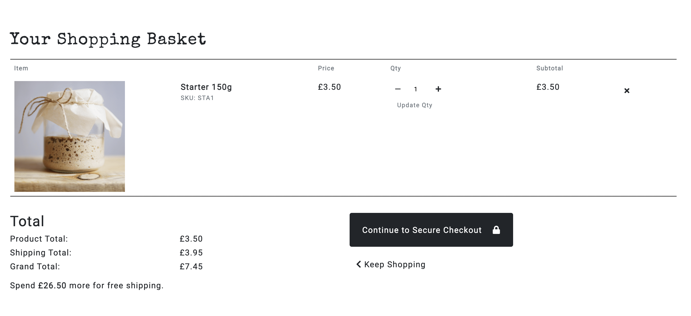
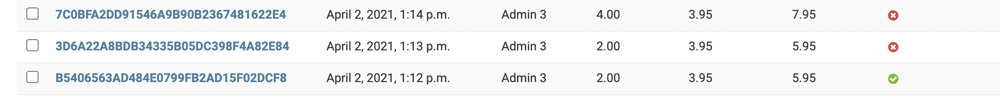

# Starter testing
- [Primary README.md file](./README.md)
- [View Website](https://https://starter-sourdough.herokuapp.com/.herokuapp.com/)

## Table of Contents
1. [Validators](#validators)
2. [User Stories](#testing-user-stories)
     - [First Time User Goals](#first-time-user-goals)
     - [Returning User Goals](#returning-user-goals)
     - [Member Goals](#returning-user-goals)
     - [Premium Member Goals](#premium-member-goals)
     - [Admin](#admin-goals)
3. [Manual Testing](#manual-testing)
   - [Devices & Browsers](#devices-tested-on)
   - [User Testing](#testing)
   - [Testing Features](#testing-interactive-elements)
4. [Bugs](#bugs)

## Validators
- HTML: [W3C Markup Validator](https://validator.w3.org/)
  - The use of Django templating in the html results in a number of errors in each file, all have been reviewed and deemed acceptable.

- CSS: [W3C CSS Validator](https://jigsaw.w3.org/css-validator/)

- JavaScript: [JSHint](https://jshint.com/)

- Python:
  - [PEP8](http://pep8online.com/)
  - [Gitpod](https://gitpod.io/)
  - 'Line too long' warning has been ignored when splitting would break a link 
## Testing User stories

### First Time User Goals
#### As a first time user, I want to: 
1. Easily understand the purpose of the website and the services it offers
    -  As user's first enter the site, the use of strong imagery suggest the nature of the site:
        

    - The logo in the header clearly states the company name and mission:   
        

    - Each aspect of the website is represented on the homepage to give the user an immediate insight in to what the site offers:
        - Recipes & Membership:
        

        - Products / Shopping: 
        

2. Be able to navigate intuitively through the site
    - The main navigation to the left of the bar shows the main website pages available to everyone.
    - The icon links to the right represent other key features of the site. 
    
    - Active classes are added to active page to show the user what page they are currently on.

### Returning User Goals
#### As a returning, I want to:
1. Browse all products and recipes
    - If user's arrived on the shop page via the 'all' navigation all products will be visable.

2. Browse via product category
    - If user's arrived on the shop page via the 'tools' or 'ingredients' the products will be filtered by their respective category with the category name displayed e.g:

    

3. Search for product and/or recipe by name or description
    - The search bar is in the navigation bar and can therefore be accessed from anywhere in the website. 
    - The entered search term searches both products and recipes names and descriptions and returns the results.
  
4. Easily see what I've searched for and the search results
    - The returned results include the product count and search term:
    [](https://gyazo.com/190d6ac2f8f9d281364ce73fd37d6c2b)

5. As a Returning User, I want to easily select the quantity of a product to be added to the basket:
    - The plus/minus buttons on the product details page allow users to control the quantity of items being added to their basket:
    [](https://gyazo.com/16cb73179af76e6dda71281aac080f61)

6. View items in my basket to be purchased
    - Clicking on the basket takes the user to their basket
    - Adding an item to the basket triggers a toast that gives a preview of the basket contents (see above).
    - The toast contains a link to 'Go to Basket' 
    

7. Be able to adjust the quantity of individual items in my basket 
    - The plus/minus controls and update button allow user's to alter the quantity of items in their basket, which also updates the totals: 
    [](https://gyazo.com/410488d8cc5c6889cd2a2efbe0d51ccb)

8. See an order confirmation after checkout
    - Once payment is completed at checkout, user's are redirected to the checkout succes page: 
    

9. Receive an email confirmation after checkout
    - 

10. Easily find how to become a member
    - There are various pointers/links to becoming a member throughout the site: 
        - The navbar
        - The memberhsip promo on the homepage (pictured above)
        - The recipes page:
        
        - Account: 
        

11. Learn about becoming a premium member
    - The premium page provides users of information of what is included with premium membership and how to cancel once purchased.
    

### Premium Member Goals
#### As a premium member, I want to:

1. View premium content 
    - The recipe cards feature a large photo, recipe title and a free or    premium tag.
    - If premium membership is not active they will not be able to view premium recipes: 
    [](https://gyazo.com/c7135788ed471bef21251476b61aec4c)
    - Once premium memberhsip is active, the user is able to access all recipes. 

2. See when new premium content is added
    - The newest recipe is automatically displayed in premium member's account with a 'new recipe' tag:
    

3. to 5. View which subscription service is enabled, easily cancel a subscription service, view my next subscription payment date
    - The premium members settings page provides all Stripe subscription information and option to cancel: 
    

### Admin Goals
#### As admin, I want to:

1. Add a product
    - The Product Management page gives superuser's the ability to add a product:
    [](https://gyazo.com/b428595459b645c0ec3b3f8c71dcd0d8)
    
2. Edit/update a product
    - Superuser's are able to edit/update a specific product from that product's details page:
    [](https://gyazo.com/3e57c1001d2ecc1ad506a1305df1d657)
  

3. Delete a product
    - Superuser's are able to delete a specific product from either that product's details page or the update/edit product page:
    [](https://gyazo.com/5012c62d0564f717db37e177c4ea4d68)
  

4. Add a recipe 
    - Add recipe works in the same way as add a product above.
5. Edit/update a recipe
    - Edit recipe works in the same way as edit a product above.  
6. Delete a recipe
    - Delete recipe works in the same way as delete a product above. 

7. Ensure all subscriptions payments are up to date
    - The Update Premium Memberships is visable to superusers in the account menu, clicking syncs profiles with Stripe Subsciption settings to ensure payments are up to date.

8. Customise the homepage to include featured products/recipes
    - The 'featured' option on a product/recips allows superusers to customise their homepage by ticking the featured checkbox when creating or editing a product/recipe. 


## Manual Testing 
### Devices & Browsers

- The Website was tested on Google Chrome, Firefox, Microsoft Edge and Safari browsers.

- The website was tested on a variety of devices including; Desktop, Laptop, iPad mini, iPhone 7, iPhone 8, iPhoneX, Nokia E30 and Galaxy S20.

- It was also viewed on all devices and orientations available in Chrome DevTools.

### User Testing

- Friends and family members viewed the site and provided feedback on bugs and UX issues.

### Testing Features / Interactive Elements

#### Elements of every page

| Element              | Expected behaviour | Tested On/By   | Confirmed 
| -------------------- | ------------------ | -----------    | ----------
| Shop Link            | Trigger shop options dropdown| click          | yes
| Main Navigation Links| Takes user to specified page  | click          | yes
| Home Logo            | Takes user to homepage | click          | yes
| Search Icon          | Trigger search dropdown      | click          | yes
| Account Icon         | Trigger account options dropdown | click | yes
| Account Options | Change options depending on user | login | yes
| Basket Icon | Takes user to basket | click | yes
| Hover Features | Change background or colour | hover | yes
| Mobile Nav | Main nav collapses in to burger nav on mobile views | collapse | yes 
| Promo Banner | Takes user to premium page | click  | yes 
| Toasts | Appear when certain actions are taken | carrying out said actions | yes 
| Footer | Featured at the bottom of each page | inspection | yes 


#### Homepage

| Element              | Expected behaviour | Tested On/By   | Confirmed 
| -------------------- | ------------------ | -----------    | ----------
| Ingredients Image | Takes user to shop filtered by ingredients | click | yes
| Tools Image | Takes user to shop filtered by tools | click | yes
| Featured Recipe | Populated by 'featured' recipe | changing from true / false in admin | yes
| Featured Recipe | Takes user to recipe | click | yes
| Membership Promo Poster | Takes user to premium page | click | yes 
| Featured Products | Populated by 'featured' products | changing from true / false in admin | yes
| Featured Products | Takes user to specified product | click | yes


#### Shop/Products

| Element              | Expected behaviour | Tested On/By   | Confirmed 
| -------------------- | ------------------ | -----------    | ----------
| Subtitle | Changes depending on where you arrived from; shop or tools | click | yes
| Product Count | Displays product count of specified filter | click / inspection | yes
| Sort Options | Change product display depening on chosen option | click | yes


#### Product Details

| Element              | Expected behaviour | Tested On/By   | Confirmed 
| -------------------- | ------------------ | -----------    | ----------
| Add to Basket button | Adds product to session basket / triggers toast that shows a preview of basket | click | yes 
| Plus/Minus Buttons | Increases/reduced amount of product to be added | click / add | yes
| Edit Button | Takes superusers to edit specific product page | click | yes 
| Delete button | Triggers defensive modal | click | yes 
| Modal cancel Button | Exits modal without any changes to products | click | yes 
| Modal Delete Button | Removes product | click | yes 

#### Inventory / Stock 
| Element              | Expected behaviour | Tested On/By   | Confirmed 
| -------------------- | ------------------ | -----------    | ----------
| Adding product quantity that exceeds product inventory | Error message and unable to proceed | Removing/Adding stock from Admin Panel | Yes 
| Attempting to proceed to checkout if item recently sold out | Error message and unable to proceed | Removing/Adding stock from Admin Panel | Yes
| Attempting to checkout if item recently sold out | Error message and unable to proceed | Removing/Adding stock from Admin Panel | No (see bugs below)


#### Shopping Basket 
| Element              | Expected behaviour | Tested On/By   | Confirmed 
| -------------------- | ------------------ | -----------    | ----------
| Update Qty | Updates quantity to specified amount, updating all totals accordingly | click | yes 
| Delete | Removes specified product from basket, updating all totals accordingly | click | yes 
| Keep Shopping | Takes user to shop | click | yes
| Continue to Secure Checkout | Takes user to checkout | click | yes 

### Product Checkout
| Element              | Expected behaviour | Tested On/By   | Confirmed 
| -------------------- | ------------------ | -----------    | ----------
| Complete Order if form/payment is invalid | User unable to proceed and source of mistake is signposted | click | yes (see bugs below for issue when pressed the enter key to submit)
| Complete Order if form/payment is valid | User directed to order confirmation, confirmation email sent to user, order created in backend | click | yes 


### Recipes
| Element              | Expected behaviour | Tested On/By   | Confirmed 
| -------------------- | ------------------ | -----------    | ----------
| Recipe cards | Takes you to specified recipe | click | yes 
| Premium recipes when logged out | Redirects user to login with message | click | yes 
| Premium recipes without a premium account | Redirects user to premium page with message | click | yes 


### Recipe Details
| Element              | Expected behaviour | Tested On/By   | Confirmed 
| -------------------- | ------------------ | -----------    | ----------
| Bootstrap Accordian | Expand/Collapse | click | yes 
| Edit Button | Takes superusers to edit specific recipe page | click | yes 
| Delete button | Triggers defensive modal | click | yes 
| Modal cancel Button | Exits modal without any changes to recipe | click | yes 
| Modal Delete Button | Removes recipe | click | yes 


### Premium (if user does not have a premium account)
| Element              | Expected behaviour | Tested On/By   | Confirmed 
| -------------------- | ------------------ | -----------    | ----------
| Payment options | Takes user to specified payment amount checkout | click | yes 

### Premium (if user does not have a premium account)
| Element              | Expected behaviour | Tested On/By   | Confirmed 
| -------------------- | ------------------ | -----------    | ----------
| Payment options | Redirects user to their account with message displayed | click | yes 

### Premium Basket/Checkout
| Element              | Expected behaviour | Tested On/By   | Confirmed 
| -------------------- | ------------------ | -----------    | ----------
| Back to options button | takes user back to premium page | click | yes
| Continue to Secure Checkout | takes user to Stripe Checkout | click | yes 


### Stripe Premium Checkout
| Element              | Expected behaviour | Tested On/By   | Confirmed 
| -------------------- | ------------------ | -----------    | ----------
| Add promotional code | advertised promo code "WELCOME10" takes 10% off first payment | entering | yes
| Subscribe button if form/payment is valid | - User directed to subscription confirmation, confirmation email sent to user, subscription and customer created in Stripe, membership info attached to user profile | click | yes 

### Account / Membership Settings
| Element              | Expected behaviour | Tested On/By   | Confirmed 
| -------------------- | ------------------ | -----------    | ----------
| Update Information | Updates users information to newly entered data | click | yes 
| Settings button | takes the user to their membership settings | click | yes 
| Cancel Membership button | Triggers modal | click | yes 
| Cancel modal | Cancels memebership on Stripe, change message displayed | click | yes 
| Order number link | takes the user to the specified order summary | click | yes


### Product Management 
| Element              | Expected behaviour | Tested On/By   | Confirmed 
| -------------------- | ------------------ | -----------    | ----------
| Add product if form is valid | Adds product to database and products | click | yes 
| Edit product | Updates product information with newly entered data | click | yes 


### Recipe Management
| Element              | Expected behaviour | Tested On/By   | Confirmed 
| -------------------- | ------------------ | -----------    | ----------
| Add recipe if form is valid | Adds receipe to database and recipes | click | yes 
| Add more ingredients | Allows user to enter more ingredients | click | yes 
| Delete ingredient checkbox | Deletes ingredients from recipes | click | yes with slight front-end issue (see bugs below)
| Edit recipe | Updates recipe information with newly entered data | click | yes 

### Update Premium Memberships
| Element              | Expected behaviour | Tested On/By   | Confirmed 
| -------------------- | ------------------ | -----------    | ----------
| Update Premium Membership link | Sync the Stripe Subscription information with the Django user profile membership settings, return HTTP response | removing customer from Stripe and click | yes 

### Allauth Pages
| Element              | Expected behaviour | Tested On/By   | Confirmed 
| -------------------- | ------------------ | -----------    | ----------
| Sign up | creates account | click | yes 
| Sign in | Signs user in | click | yes 
| Sign out | Signs user out | click | yes 

### Confirmation Emails
| Element              | Expected behaviour | Tested On/By   | Confirmed 
| -------------------- | ------------------ | -----------    | ----------
| Order confirmation | automatically sent on successful purchase of product | Placed order | yes 
| Membership Subsciption confirmation | automatically sent on successful memberhsip subscription | Subscribe to premium memberhsip | yes 

## Bugs
### Fixed / Worked Around

- Ingredient Formset 
    - The ingredient formset in Recipe Management was throwing a 'required field' error even though the form was valid.
    - Whilst it didn't affect the ability to add a recipe, it may have caused confusion for users. 
    - I chose to redirect user's to the Recipes page after a recipe is successfully added, instead of showing a cleared form. 

- Update Accounts issue on Deployed Version 
    - When deployed, the update_accounts function began throwing a 500 error. I discovered this was due to try to retrieve Stripe Subscription information for users that didn't have any. I fixed this with the inclusion of ` if profile.membership:`. 
    - However, this means that at least one profile will have to have a Stripe Subscription at all times. 

### Persisting
- Ability to purchase sold out items at checkout submit
    - The inventory levels are checked various points to avoid users being able to purchase sold out items. However at the final stage, they are able to do this. I tried the following solutions: 
        | Attempted Fix | Failed due to 
        | ------------- | -------------
        | Add inventory condition to post data e.g `if not product.has_inventory() -> order.delete()` | The deleted order was still being created in the webhook 
        | Add inventory condition(as above) to payment_intent.succeeded webhook handler | The order was not being created, however Stripe was still charging the user 
        | Create a webhook handler for charge.succeeded | Failing the charge.succeeded continued to charge the user in Stripe
        | Change where stock was removed from checkout view to add_to_basket view | Could not get the inventory to be added back to stock on session end

        |Potentional solution beyond the scope of this project|
        -------------------------------------------------------

        Add a held_inventory object to Product model. 
        
        On add_to_basket view execute: 
        ```
        inventory - item quantity
        held_inventory + item quantity 
        ```

        Create a background task using task queue software e.g. [Django Background Task](https://django-background-tasks.readthedocs.io/en/latest/) or [Django Celery](https://docs.celeryproject.org/projects/django-celery/en/2.4/) that runs every hour: 
        ```
        held_inventory + inventory
        ```
    - Currently, if an order is created when there isn't enough stock, the order will fail the 'order_fullfilled' object. This is to notify the site owners as soon as possible: 
    

- Checkout Submit Button 
    - Hitting the enter key as opposed to clicking the submit button bypassed the form validation resulting in the following: 
    [](https://gyazo.com/f2308004711008b484d4f0c88c945525)
    - My assumption is that stripe js elements overrides the form validation but have not been able to identify where
    - I tried changing the submit button input type to no avail.
    
- Nav menu mobile dropdown
    - On mobile, if the nav menu is showing and the search bar dropdown is triggered, the search will attach to the bottom of the nav menu: 
   [](https://gyazo.com/2623b1476a557ebd7a72ee3a34d93a9a)
    - This is likely because the search bar used Bootstrap Dropdown, whilst the nav menu uses Bootstrap collapse.


